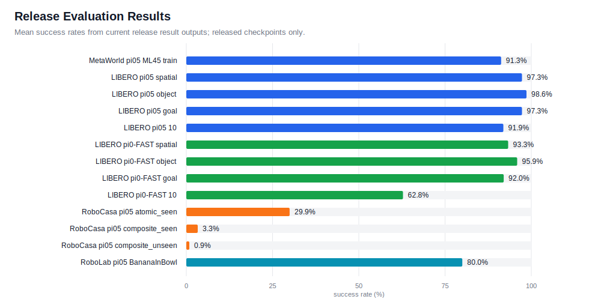

# openpi-eval

Focused OpenPI evaluation repo for pretrained `pi05` policies in MetaWorld,
LIBERO, RoboCasa, and RoboLab, plus released `pi0_fast` support where noted.

JAX is the default backend for training, serving, and evaluation. PyTorch serving
is available for `pi05` checkpoints through JAX-to-PyTorch conversion.

## Teaser Rollouts

Click a preview to open the full MP4.

<table>
  <tr>
    <td align="center">
      <strong>MetaWorld</strong><br>
      <a href="docs/assets/rollouts/metaworld_drawer_open_success.mp4">
        
      </a>
      <br><sub><code>pi05_metaworld</code>, drawer-open-v3</sub>
    </td>
    <td align="center">
      <strong>LIBERO</strong><br>
      <a href="docs/assets/rollouts/libero_bbq_sauce_success.mp4">
        
      </a>
      <br><sub><code>pi05_libero</code>, BBQ sauce to basket</sub>
    </td>
    <td align="center">
      <strong>RoboCasa</strong><br>
      <a href="docs/assets/rollouts/robocasa_slide_dishwasher_success.mp4">
        
      </a>
      <br><sub><code>pi05_robocasa</code>, SlideDishwasherRack</sub>
    </td>
  </tr>
  <tr>
    <td align="center" colspan="3">
      <strong>RoboLab</strong><br>
      <a href="docs/assets/rollouts/robolab_one_bottle_square_pail_success.mp4">
        
      </a>
      <br><sub><code>pi05_droid_jointpos</code>, OneBottleInSquarePailTask</sub>
    </td>
  </tr>
</table>

## Evaluation Results

Current release success rates from `results.json` outputs are summarized below.
Detailed charts live in the simulator READMEs.
RoboLab release results are not included in this release.



## Support Matrix

| Simulator | `pi05` | `pi0_fast` | Notes | Guide |
|---|---|---|---|---|
| MetaWorld | `pi05_metaworld` checkpoint | Training example only | JAX eval; optional `pi05` PyTorch serving | [MetaWorld](examples/metaworld/README.md) |
| LIBERO | `pi05_libero` checkpoint | `pi0_fast_libero` checkpoint | JAX eval; optional `pi05` PyTorch serving | [LIBERO](examples/libero_env/README.md) |
| RoboCasa | `pi05_robocasa` checkpoint | config only | JAX eval; `pi0_fast` checkpoint not included in this release | [RoboCasa](examples/robocasa_env/README.md) |
| RoboLab | `pi05_droid_jointpos` checkpoint | `pi0_fast_droid_jointpos` checkpoint | JAX eval through latest RoboLab Pi0-family runner; release results not included | [RoboLab](examples/robolab_env/README.md) |

Checkpoint download commands, training examples, evaluation commands, and
environment-specific troubleshooting live in the linked guides.

## Setup

```bash
GIT_LFS_SKIP_SMUDGE=1 git submodule update --init --recursive
uv sync
```

Simulator clients use environment-specific dependencies:

- [MetaWorld](examples/metaworld/README.md): root repo environment.
- [LIBERO](examples/libero_env/README.md): separate Python 3.8 simulator environment.
- [RoboCasa](examples/robocasa_env/README.md): separate Python 3.11+ simulator environment with kitchen assets.
- [RoboLab](examples/robolab_env/README.md): separate Python 3.11 simulator environment with Isaac Sim 5.0.

Use EGL on GPU machines:

```bash
export MUJOCO_GL=egl
```

## Backend Notes

- JAX is the default path for training, serving, and evaluation.
- `--pytorch` is an optional serving path for `pi05` checkpoints.
- Treat released `pi0_fast` evaluation as JAX-only in this release.
