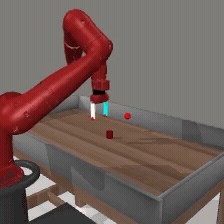

# openpi-eval

Focused OpenPI evaluation repo for pretrained `pi05` and `pi0_fast` policies in
MetaWorld, LIBERO, and RoboCasa.

JAX is the default backend for training, serving, and evaluation. PyTorch serving
is available for `pi05` checkpoints through JAX-to-PyTorch conversion.

## Teaser Rollouts

Click a preview to open the full MP4.

<table>
  <tr>
    <th>MetaWorld</th>
    <th>LIBERO</th>
    <th>RoboCasa</th>
  </tr>
  <tr>
    <td>
      <a href="docs/assets/rollouts/metaworld_reach_success.mp4">
        
      </a>
      <br><sub><code>pi05_metaworld</code>, reach-v3</sub>
    </td>
    <td>
      <a href="docs/assets/rollouts/libero_bbq_sauce_success.mp4">
        
      </a>
      <br><sub><code>pi05_libero</code>, BBQ sauce to basket</sub>
    </td>
    <td>
      <a href="docs/assets/rollouts/robocasa_turn_on_sink_success.mp4">
        
      </a>
      <br><sub><code>pi05_robocasa</code>, TurnOnSinkFaucet</sub>
    </td>
  </tr>
</table>

## Support Matrix

| Simulator | `pi05` | `pi0_fast` | Notes | Guide |
|---|---|---|---|---|
| MetaWorld | `pi05_metaworld` checkpoint | `pi0_fast_metaworld` checkpoint | JAX eval; optional `pi05` PyTorch serving | [MetaWorld](examples/metaworld/README.md) |
| LIBERO | `pi05_libero` checkpoint | `pi0_fast_libero` checkpoint | JAX eval; optional `pi05` PyTorch serving | [LIBERO](examples/libero_env/README.md) |
| RoboCasa | `pi05_robocasa` checkpoint | config only | JAX eval; `pi0_fast` checkpoint not included in this release | [RoboCasa](examples/robocasa_env/README.md) |

Checkpoint download commands, simulator setup, evaluation commands, and
environment-specific troubleshooting live in the linked guides.

## Setup

```bash
git submodule update --init --recursive
GIT_LFS_SKIP_SMUDGE=1 uv sync
```

Simulator clients use environment-specific dependencies:

- [MetaWorld](examples/metaworld/README.md): root repo environment.
- [LIBERO](examples/libero_env/README.md): separate Python 3.8 simulator environment.
- [RoboCasa](examples/robocasa_env/README.md): separate Python 3.11+ simulator environment with kitchen assets.

Use EGL on GPU machines:

```bash
export MUJOCO_GL=egl
```

## Backend Notes

- JAX is the default path for `pi05` and `pi0_fast`.
- `--pytorch` is an optional serving path for `pi05` checkpoints.
- Treat `pi0_fast` evaluation as JAX-only in this release.
