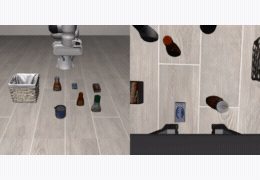
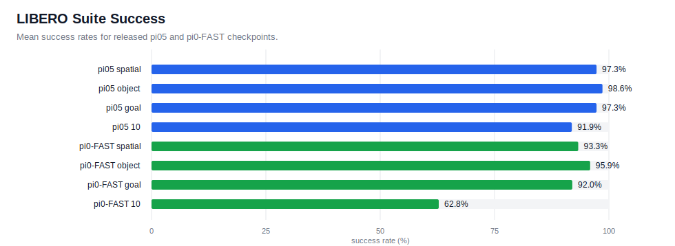

# LIBERO

[LIBERO](https://libero-project.github.io/) is a robot manipulation benchmark with four suites: `libero_spatial`, `libero_object`, `libero_goal`, and `libero_10`.

This example uses its own Python 3.8 venv. The simulator runs here and talks to the root policy server over WebSocket.

- `main.py`: one suite task, selected by `--task_suite_name` and `--task_id`.
- `eval_all.py`: one subprocess per task in a suite.

## Example Rollout

<a href="../../docs/assets/rollouts/libero_bbq_sauce_success.mp4">
  
</a>

<sub><code>pi05_libero</code>, BBQ sauce to basket</sub>

## Setup

```bash
git submodule update --init --recursive

cd examples/libero_env
uv sync
uv run python setup_libero_config.py
```

Use EGL for GPU rendering:

```bash
export MUJOCO_GL=egl
```

## Training

The configs use [`physical-intelligence/libero`](https://huggingface.co/datasets/physical-intelligence/libero).

```bash
# pi0.5 training
uv run scripts/compute_norm_stats.py --config-name pi05_libero
XLA_PYTHON_CLIENT_MEM_FRACTION=0.9 uv run scripts/train.py pi05_libero \
    --exp-name pi05_libero_test \
    --overwrite \
    --num_train_steps 30000

# pi0-FAST training
uv run scripts/compute_norm_stats.py --config-name pi0_fast_libero
XLA_PYTHON_CLIENT_MEM_FRACTION=0.9 uv run scripts/train.py pi0_fast_libero \
    --exp-name pi0_fast_libero_train \
    --overwrite \
    --num_train_steps 30000
```

Registered configs:

- `pi05_libero`
- `pi0_fast_libero`

## Checkpoints

- `pi05_libero`: [`brandonyang/openpi-libero-9000`](https://huggingface.co/brandonyang/openpi-libero-9000)
- `pi0_fast_libero`: `2000` from [`brandonyang/pi0fast-libero-checkpoints`](https://huggingface.co/brandonyang/pi0fast-libero-checkpoints)

Download:

```bash
hf download brandonyang/openpi-libero-9000 \
    --local-dir checkpoints/openpi-libero-9000

hf download brandonyang/pi0fast-libero-checkpoints \
    --include "pi0_fast_libero_b200_bs512/2000/*" \
    --local-dir checkpoints/pi0fast-libero-checkpoints
```

## Serve

Start a policy server from the repo root.

```bash
# pi0.5, JAX backend
uv run scripts/serve_policy.py policy:checkpoint \
    --policy.config=pi05_libero \
    --policy.dir=checkpoints/openpi-libero-9000

# pi0.5, PyTorch backend. The first run auto-converts to model.safetensors.
uv run scripts/serve_policy.py --pytorch policy:checkpoint \
    --policy.config=pi05_libero \
    --policy.dir=checkpoints/openpi-libero-9000

# pi0-FAST, JAX only
uv run scripts/serve_policy.py policy:checkpoint \
    --policy.config=pi0_fast_libero \
    --policy.dir=checkpoints/pi0fast-libero-checkpoints/pi0_fast_libero_b200_bs512/2000
```

## Evaluate

Run clients from `examples/libero_env`.

```bash
# Single task
MUJOCO_GL=egl uv run python main.py --task_suite_name libero_10 --task_id 0 --num_episodes 15

# Full suite
MUJOCO_GL=egl uv run python eval_all.py --task_suite_name libero_10 --num_workers 5

# Sequential debug mode
MUJOCO_GL=egl uv run python eval_all.py --task_suite_name libero_10 --num_workers 1
```

Output layout:

```text
examples/libero_env/output/<task_suite_name>/
|-- results.json
|-- parallel_logs/task_NN.log
`-- <task_id>-<task_name>/episode_NNN.mp4
```

Generated results are written to `examples/libero_env/output/` and should be
published only after a fresh release evaluation.

## Results

Current release suite evaluations from `results.json`.



## Tests

```bash
cd examples/libero_env
uv run pytest tests/ -v
```
