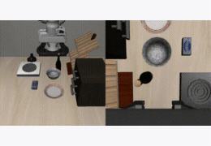

# LIBERO-Pro

[LIBERO-Pro](https://github.com/Zxy-MLlab/LIBERO-PRO) extends LIBERO with
perturbed evaluation suites for robustness and generalization: object,
position, semantic language, and task shifts.

This example uses its own Python 3.8 venv because LIBERO-Pro installs the same
Python package name as LIBERO (`libero`). The simulator runs here and talks to
the root policy server over WebSocket.

- `main.py`: one suite task, selected by `--task_suite_name` and `--task_id`.
- `eval_all.py`: one subprocess per task in a suite.

## Example Rollout

<a href="../../docs/assets/rollouts/liberopro_goal_task_drawer_pi05_rollout.mp4">
  
</a>

<sub><code>pi05_libero</code>, <code>libero_goal_task</code> drawer task, non-success rollout</sub>

## Setup

From the repo root:

```bash
git submodule update --init --recursive third_party/liberopro

uvx --from huggingface_hub hf download zhouxueyang/LIBERO-Pro \
    --repo-type dataset \
    --include "bddl_files/*" \
    --include "init_files/*" \
    --local-dir /tmp/liberopro-data

cp -a /tmp/liberopro-data/bddl_files/. \
    third_party/liberopro/libero/libero/bddl_files/
cp -a /tmp/liberopro-data/init_files/. \
    third_party/liberopro/libero/libero/init_files/

cd examples/liberopro_env
uv sync
uv run python setup_liberopro_config.py
```

`setup_liberopro_config.py` writes
`${LIBERO_CONFIG_PATH:-~/.liberopro}/config.yaml`. `main.py` sets
`LIBERO_CONFIG_PATH` to `~/.liberopro` by default so it does not collide with
the regular LIBERO client.

The submodule provides code, while the generated LIBERO-Pro BDDL and init-state
folders come from the `zhouxueyang/LIBERO-Pro` Hugging Face dataset. Without
those generated files, perturbed suites such as `libero_goal_task` cannot be
constructed.

The supported and tested generated suite families are position (`*_swap`),
object (`*_object`), semantic-language (`*_lan`), and task (`*_task`). Other
upstream-registered suites may need additional files or validation.

Use EGL for GPU rendering:

```bash
export MUJOCO_GL=egl
```

## Configs

LIBERO-Pro reuses the LIBERO policy interface and released LIBERO configs.

Registered configs:

- `pi05_libero`
- `pi0_fast_libero`

## Checkpoints

LIBERO-Pro evaluates the released LIBERO policies on perturbed LIBERO suites.

- `pi05_libero`: [`brandonyang/openpi-libero-9000`](https://huggingface.co/brandonyang/openpi-libero-9000)
- `pi0_fast_libero`: `2000` from [`brandonyang/pi0fast-libero-checkpoints`](https://huggingface.co/brandonyang/pi0fast-libero-checkpoints)

Download from the repo root:

```bash
hf download brandonyang/openpi-libero-9000 \
    --local-dir checkpoints/openpi-libero-9000

hf download brandonyang/pi0fast-libero-checkpoints \
    --include "pi0_fast_libero_b200_bs512/2000/*" \
    --local-dir checkpoints/pi0fast-libero-checkpoints
```

## Serve

Start a policy server from the repo root.

```bash
# pi0.5, JAX backend
uv run scripts/serve_policy.py policy:checkpoint \
    --policy.config=pi05_libero \
    --policy.dir=checkpoints/openpi-libero-9000

# pi0-FAST, JAX only
uv run scripts/serve_policy.py policy:checkpoint \
    --policy.config=pi0_fast_libero \
    --policy.dir=checkpoints/pi0fast-libero-checkpoints/pi0_fast_libero_b200_bs512/2000
```

## Evaluate

Run clients from `examples/liberopro_env`.

```bash
# Single task
MUJOCO_GL=egl uv run python main.py \
    --task_suite_name libero_goal_task \
    --task_id 0 \
    --num_episodes 15

# Full suite
MUJOCO_GL=egl uv run python eval_all.py \
    --task_suite_name libero_10_object \
    --num_workers 5

# Sequential debug mode
MUJOCO_GL=egl uv run python eval_all.py \
    --task_suite_name libero_goal_task \
    --num_workers 1
```

Useful suite families include:

| Perturbation | Example suites |
|---|---|
| Position | `libero_goal_swap`, `libero_spatial_swap`, `libero_10_swap`, `libero_object_swap` |
| Object | `libero_goal_object`, `libero_spatial_object`, `libero_10_object`, `libero_object_object` |
| Semantic language | `libero_goal_lan`, `libero_spatial_lan`, `libero_10_lan`, `libero_object_lan` |
| Task | `libero_goal_task`, `libero_spatial_task`, `libero_10_task`, `libero_object_task` |

Output layout:

```text
examples/liberopro_env/output/<task_suite_name>/
|-- results.json
|-- parallel_logs/task_NN.log
`-- <task_id>-<task_name>/episode_NNN.mp4
```

Generated results are written to `examples/liberopro_env/output/` and should be
published only after a fresh release evaluation.

## Results

No LIBERO-Pro release evaluation results are included yet. Publish results only
after running a fresh evaluation against the generated LIBERO-Pro suite files.

## Tests

```bash
cd examples/liberopro_env
uv run pytest tests/test_eval_all.py tests/test_liberopro_env.py::TestSetupLiberoProConfig -v
uv run pytest tests/test_liberopro_env.py::TestLiberoProRegistryAndDataResolution -v

RUN_LIBEROPRO_ENV_TESTS=1 MUJOCO_GL=egl \
    uv run pytest tests/test_liberopro_env.py::TestLiberoProEnv -v
```
