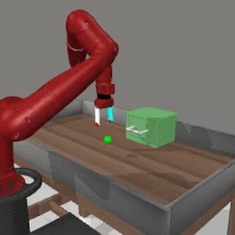
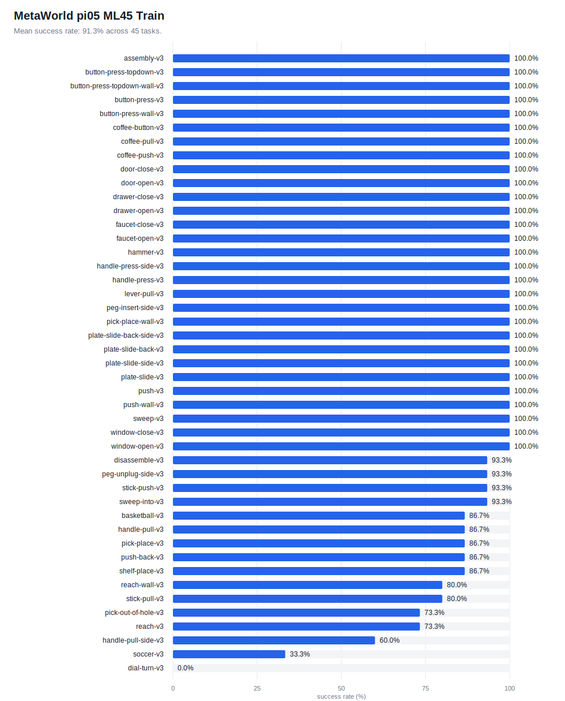

# MetaWorld

[MetaWorld](https://meta-world.github.io/) is a 50-task MuJoCo manipulation benchmark. This directory has:

- `generate_dataset.py`: scripted-policy rollouts into LeRobot format.
- `main.py`: one task with vectorized envs.
- `eval_all.py`: a split or explicit task list, one task after another.

MetaWorld uses the root repo venv.

## Example Rollout

<a href="../../docs/assets/rollouts/metaworld_drawer_open_success.mp4">
  
</a>

<sub><code>pi05_metaworld</code>, drawer-open-v3</sub>

## Setup

```bash
GIT_LFS_SKIP_SMUDGE=1 git submodule update --init --recursive
uv sync
```

Use EGL for GPU rendering:

```bash
export MUJOCO_GL=egl
```

## Training Data

The training config expects the LeRobot dataset [`brandonyang/metaworld_ml45`](https://huggingface.co/datasets/brandonyang/metaworld_ml45).

```bash
# pi0.5 training
uv run scripts/compute_norm_stats.py --config-name pi05_metaworld
XLA_PYTHON_CLIENT_MEM_FRACTION=0.9 uv run scripts/train.py pi05_metaworld \
    --exp-name pi05_metaworld_test \
    --overwrite \
    --num_train_steps 30000

# pi0-FAST training example. No converged MetaWorld pi0-FAST checkpoint is
# included in this release.
uv run scripts/compute_norm_stats.py --config-name pi0_fast_metaworld
XLA_PYTHON_CLIENT_MEM_FRACTION=0.9 uv run scripts/train.py pi0_fast_metaworld \
    --exp-name pi0_fast_metaworld_train \
    --overwrite \
    --num_train_steps 30000
```

## Checkpoints

- `pi05_metaworld`: [`brandonyang/openpi-metaworld-25000`](https://huggingface.co/brandonyang/openpi-metaworld-25000)

Download pi0.5:

```bash
hf download brandonyang/openpi-metaworld-25000 \
    --local-dir checkpoints/openpi-metaworld-25000
```

## Serve

Start a policy server from the repo root.

```bash
# pi0.5, JAX backend
uv run scripts/serve_policy.py policy:checkpoint \
    --policy.config=pi05_metaworld \
    --policy.dir=/path/to/checkpoint

# pi0.5, PyTorch backend. The first run auto-converts to model.safetensors.
uv run scripts/serve_policy.py --pytorch policy:checkpoint \
    --policy.config=pi05_metaworld \
    --policy.dir=/path/to/checkpoint
```

## Evaluate

MetaWorld parallelizes within a task. `--num_envs N` runs N copies of the same task and batches them into one policy call.

```bash
# Single task
MUJOCO_GL=egl uv run examples/metaworld/main.py --env_name reach-v3 --num_envs 15

# Curated subset
MUJOCO_GL=egl uv run examples/metaworld/eval_all.py --split subset --num_envs 15

# Full ML45 train or test split
MUJOCO_GL=egl uv run examples/metaworld/eval_all.py --split train --num_envs 15
MUJOCO_GL=egl uv run examples/metaworld/eval_all.py --split test --num_envs 15

# Explicit task list
MUJOCO_GL=egl uv run examples/metaworld/eval_all.py --tasks reach-v3 push-v3 pick-place-v3
```

Outputs default to `examples/metaworld/output/`. `results.json` is saved incrementally.
Each episode also writes an `episode_XXX.json` sidecar next to its video recording the
per-env success/reward and per-request inference latency — the world-model server's
`server_timing.infer_ms` plus client round-trip — so Wan latency/quality tradeoffs are
auditable after a run.

Generated results are written to `examples/metaworld/output/` and should be
published only after a fresh release evaluation.

## Results

Current release `pi05_metaworld` ML45 train evaluation from `results.json`.


