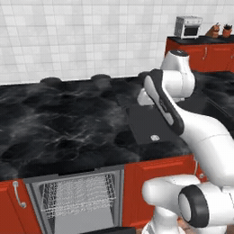
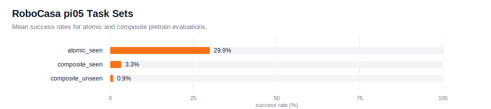
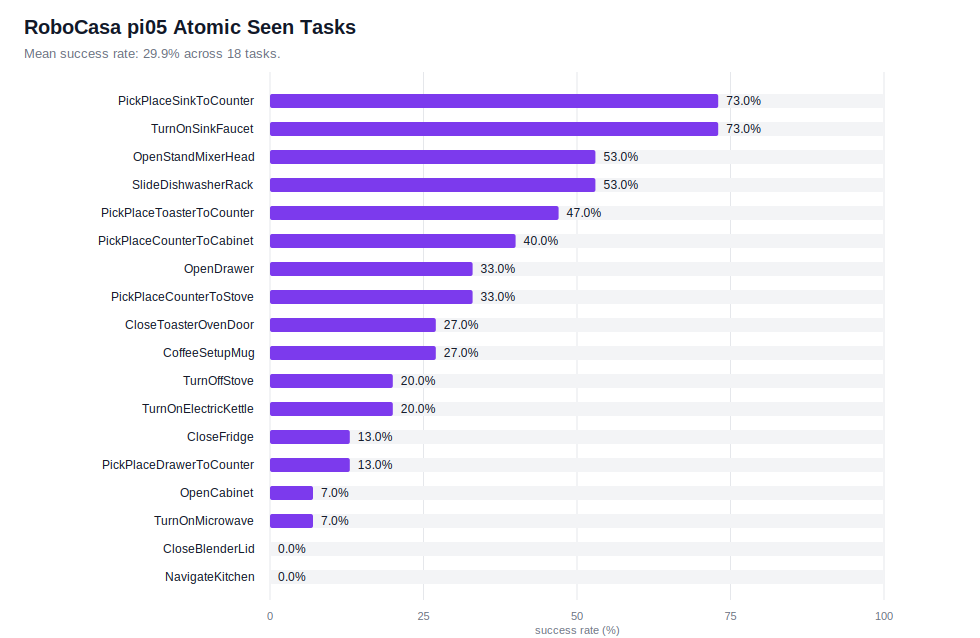

# RoboCasa

[RoboCasa](https://robocasa.ai/docs/build/html/index.html) is a kitchen manipulation benchmark built on robosuite.

This example uses its own Python 3.11+ venv. The simulator runs here and talks to the root policy server over WebSocket.

- `main.py`: one RoboCasa env.
- `eval_all.py`: one subprocess per env in a task set.

## Example Rollout

<a href="../../docs/assets/rollouts/robocasa_slide_dishwasher_success.mp4">
  
</a>

<sub><code>pi05_robocasa</code>, SlideDishwasherRack</sub>

## Setup

```bash
git submodule update --init --recursive

cd examples/robocasa_env
uv sync
uv run python -m robocasa.scripts.setup_macros
uv run python -m robocasa.scripts.download_kitchen_assets
```

The kitchen assets download is about 10 GB. For non-interactive setup:

```bash
printf 'y\n' | uv run python -m robocasa.scripts.download_kitchen_assets
```

Use EGL for GPU rendering:

```bash
export MUJOCO_GL=egl
```

## Configs

Registered configs:

- `pi05_robocasa`
- `pi0_fast_robocasa`

`pi0_fast_robocasa` is wired for future training; this release includes a
`pi05_robocasa` checkpoint only.

## Checkpoint

- `pi05_robocasa`: `pi05_pretrain_human300/multitask_learning/75000` from [`robocasa/robocasa365_checkpoints`](https://huggingface.co/robocasa/robocasa365_checkpoints)

Download from the repo root:

```bash
hf download robocasa/robocasa365_checkpoints \
    --include "pi05_pretrain_human300/multitask_learning/75000/*" \
    --local-dir checkpoints

mkdir -p checkpoints/pi05_pretrain_human300/multitask_learning/75000/assets/robocasa
mv checkpoints/pi05_pretrain_human300/multitask_learning/75000/assets/norm_stats.json \
   checkpoints/pi05_pretrain_human300/multitask_learning/75000/assets/robocasa/
```

## Serve

Start the policy server from the repo root.

```bash
# JAX backend
uv run scripts/serve_policy.py policy:checkpoint \
    --policy.config=pi05_robocasa \
    --policy.dir=checkpoints/pi05_pretrain_human300/multitask_learning/75000

# PyTorch backend. The first run auto-converts to model.safetensors.
uv run scripts/serve_policy.py --pytorch policy:checkpoint \
    --policy.config=pi05_robocasa \
    --policy.dir=checkpoints/pi05_pretrain_human300/multitask_learning/75000
```

## Evaluate

Run clients from `examples/robocasa_env`.

```bash
# Single env
MUJOCO_GL=egl uv run python main.py --env_name CloseBlenderLid --num_episodes 15

# Curated 7-task subset
MUJOCO_GL=egl uv run python eval_all.py --num_workers 5

# Full atomic-seen task set
MUJOCO_GL=egl uv run python eval_all.py --task_set atomic_seen --num_workers 5

# Full composite task sets
MUJOCO_GL=egl uv run python eval_all.py --task_set composite_seen --num_workers 5
MUJOCO_GL=egl uv run python eval_all.py --task_set composite_unseen --num_workers 5

# Explicit env list
MUJOCO_GL=egl uv run python eval_all.py --tasks OpenDrawer CloseFridge
```

RoboCasa cannot share EGL contexts in one process, so `eval_all.py` launches one `main.py` subprocess per env. Use `--num_workers 1` for sequential debugging.

Output layout:

```text
examples/robocasa_env/output/<task_set>-<split>/
|-- results.json
|-- parallel_logs/task_NN_<env>.log
`-- <env_name>/episode_NNN.mp4
```

Generated results are written to `examples/robocasa_env/output/` and should be
published only after a fresh release evaluation.

## Results

Current release task-set evaluations from aggregate `results.json` files.



Atomic-seen per-task success rates:



## Tests

```bash
cd examples/robocasa_env
uv run pytest --strict-markers -m "not manual" tests/ -v
```
