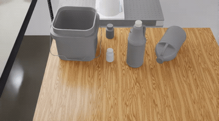

# RoboLab

[RoboLab](https://research.nvidia.com/labs/srl/projects/robolab) is NVIDIA's Isaac Lab benchmark for multi-task robot manipulation.

This example uses the latest RoboLab submodule and its Pi0-family runner. The simulator runs in this Python 3.11 environment and talks to the root OpenPI policy server over WebSocket.

- `main.py`: thin wrapper around `third_party/robolab/policies/pi0_family/run.py`.
- Output: `third_party/robolab/output/<timestamp>_<policy>/`.

## Example Rollout

<a href="../../docs/assets/rollouts/robolab_one_bottle_square_pail_success.mp4">
  
</a>

<sub><code>pi05_droid_jointpos</code>, OneBottleInSquarePailTask</sub>

## Setup

```bash
GIT_LFS_SKIP_SMUDGE=1 git submodule update --init --recursive third_party/robolab
git -C third_party/robolab lfs pull

cd examples/robolab_env
uv venv --python 3.11
uv sync
```

RoboLab installs Isaac Sim 5.0 and Isaac Lab 2.2.0 through `uv`. The RoboLab assets are about 7 GB. Full evaluation is expected on Linux NVIDIA GPU hosts.

## Configs

Registered configs:

- `pi05_droid_jointpos`
- `pi0_droid_jointpos`
- `pi0_fast_droid_jointpos`

`pi05_droid_jointpos` is the default example config for the commands below.

## Serve

Start the policy server from the repo root. JAX serving is the default path.

```bash
CUDA_VISIBLE_DEVICES=1 XLA_PYTHON_CLIENT_MEM_FRACTION=0.5 \
uv run scripts/serve_policy.py policy:checkpoint \
    --policy.config=pi05_droid_jointpos \
    --policy.dir=gs://openpi-assets-simeval/pi05_droid_jointpos
```

## Evaluate

Run clients from `examples/robolab_env`.

```bash
CUDA_VISIBLE_DEVICES=1 OMNI_KIT_ACCEPT_EULA=YES \
uv run python main.py --policy pi05 --headless \
    --task BananaInBowlTask --num-envs 10 --num-runs 1 --enable-subtask
```

RoboLab vectorizes episodes inside one Isaac Sim process:

```text
episodes per task = --num-envs * --num-runs
```

Use `--num-envs` for parallel episodes and increase `--num-runs` only when the desired batch does not fit in GPU memory. For adaptive sampling, use RoboLab's `--num-episodes-adaptive MAX_N`.

Smoke-test multiple tasks with a small batch:

```bash
CUDA_VISIBLE_DEVICES=1 OMNI_KIT_ACCEPT_EULA=YES \
uv run python main.py --policy pi05 --headless \
    --task BananaInBowlTask RubiksCubeAndBananaTask --num-envs 1 --num-runs 1 \
    --video-mode none
```

The default connection is `localhost:8000`; pass `--remote-host`, `--remote-port`, or `--remote-uri` for remote policy servers.

## Results

No RoboLab release evaluation results are included in this release. Full evaluation requires Isaac Sim, RoboLab assets, and sustained NVIDIA GPU time.

Generated results live under `third_party/robolab/output/` and should be published only after a fresh release evaluation. RoboLab's dashboard can inspect those runs:

```bash
cd third_party/robolab
uv run robolab-dashboard
```

## Tests

```bash
cd examples/robolab_env
uv run pytest tests/ -v
```

Full simulator evaluation is manual because it requires Isaac Sim, RoboLab assets, and an NVIDIA GPU.
